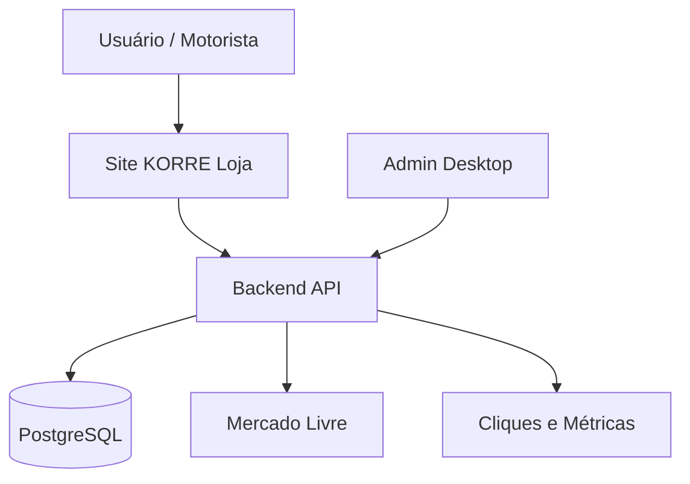

# Arquitetura geral — KORRE Loja

## Visão geral

A arquitetura da KORRE Loja será composta por três aplicações principais:

```txt
korre-loja/
  apps/
    web-store/
    api/
    admin-desktop/
  packages/
    shared/
  docs/
```

## Diagrama lógico



## Componentes

### 1. Site público

Responsável por apresentar produtos e redirecionar o usuário para o Mercado Livre.

Principais funções:

- listar produtos;
- filtrar por categoria;
- destacar produtos recomendados;
- gerar clique rastreável;
- redirecionar para link afiliado;
- exibir aviso de afiliado.

### 2. Backend

Responsável pela camada de dados e regras administrativas.

Principais funções:

- CRUD de produtos;
- CRUD de categorias;
- links afiliados;
- tracking de cliques;
- relatórios;
- autenticação admin;
- auditoria;
- API para site público;
- API para admin desktop.

### 3. Admin desktop

Responsável pela gestão interna.

Principais funções:

- ver dashboard;
- cadastrar produto;
- editar produto;
- ativar/inativar produto;
- ver produtos mais clicados;
- ver cliques por categoria;
- ver cliques por origem;
- gerenciar campanhas;
- configurar links e parâmetros.

## Deploy sugerido

### Site público

- Vercel ou Netlify.
- Deploy estático ou SSR leve.
- Domínio sugerido: `loja.korre-app.netlify.app` ou subdomínio próprio futuro.

### Backend

- Render, Railway, Fly.io ou VPS/EC2.
- HTTPS obrigatório.
- Variáveis de ambiente seguras.

### Banco

- PostgreSQL gerenciado.
- Opções: Neon, Supabase, Render PostgreSQL, Railway PostgreSQL ou RDS.

### Admin desktop

- Distribuição interna.
- Configuração de URL da API.
- Sem banco local obrigatório.

## Comunicação

### Site público → Backend

- Buscar produtos públicos.
- Registrar clique.
- Buscar categorias.
- Buscar destaques.

### Admin desktop → Backend

- Login admin.
- Gerenciar produtos.
- Gerenciar categorias.
- Ver relatórios.
- Gerenciar campanhas.

### Backend → Mercado Livre

No MVP, o backend pode apenas armazenar links de produto/afiliado cadastrados manualmente.

Em evolução futura, poderá integrar APIs oficiais disponíveis e permitidas para enriquecer dados de produtos, respeitando as regras da plataforma.

## Princípios técnicos

- Não depender de scraping no MVP.
- Não processar pagamento.
- Não armazenar dados sensíveis de compradores.
- Registrar somente métricas necessárias.
- Separar cliques anônimos de dados pessoais.
- Manter logs administrativos.
- Usar IDs internos para produtos e categorias.
