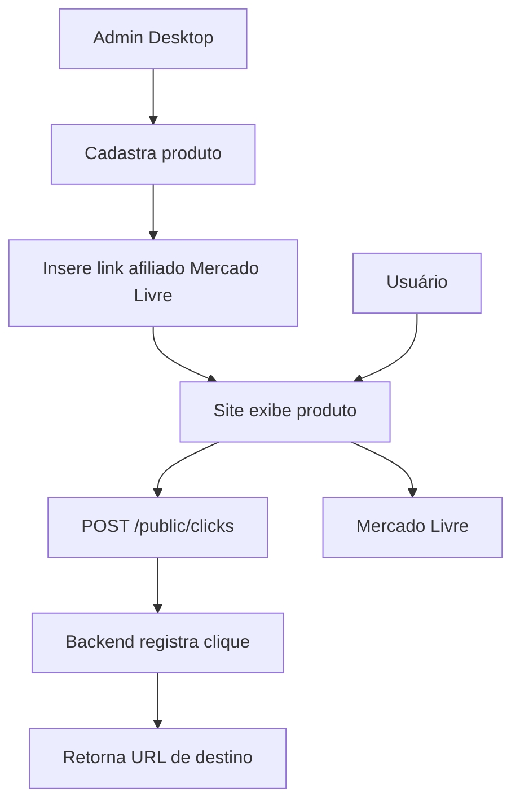

# Mercado Livre e afiliados — Loja do Korre

## Objetivo

Este documento define como a Loja do Korre deve trabalhar com produtos do Mercado Livre no modelo de afiliados.

A ideia inicial é simples:

1. A equipe escolhe produtos relevantes para motoristas e entregadores.
2. O produto é cadastrado no admin da Loja do Korre.
3. O produto recebe um link do Mercado Livre com identificação de afiliado, quando disponível.
4. O site exibe o produto.
5. O usuário clica em “Ver no Mercado Livre”.
6. O backend registra o clique.
7. O usuário é redirecionado para o Mercado Livre.

## Modelo recomendado para o MVP

No MVP, usar cadastro manual de produtos e links afiliados.

Motivos:

- reduz complexidade;
- evita dependência imediata de API externa;
- permite curadoria real;
- facilita controlar quais produtos aparecem;
- evita scraping;
- permite publicar mais rápido.

## Fluxo MVP



## Dados do produto

Campos sugeridos:

- nome;
- slug;
- descrição curta;
- descrição completa;
- categoria;
- tags;
- tipo de veículo: carro, moto ou ambos;
- público: motorista, entregador, motoboy, geral;
- imagem;
- preço de referência;
- link original;
- link afiliado;
- status;
- destaque;
- motivo da recomendação.

## Aviso de afiliado

O site deve mostrar aviso transparente:

> Alguns links da Loja do Korre podem ser links de afiliado. Podemos receber uma comissão se você comprar pelo link, sem custo extra para você.

## O que evitar

- Não fazer scraping de páginas do Mercado Livre.
- Não copiar conteúdo protegido de anúncios sem autorização.
- Não prometer preço fixo se o preço pode mudar.
- Não prometer comissão.
- Não exibir produto sem revisar se é adequado ao público.
- Não usar categorias restritas, perigosas, ilegais ou incompatíveis com a política da plataforma.
- Não manipular cliques artificialmente.

## Atualização de preço

No MVP, o preço exibido deve ser tratado como referência.

Texto sugerido:

> Preço sujeito a alteração no Mercado Livre. Confira o valor final antes da compra.

## Integração futura com API

Em uma fase futura, avaliar uso de APIs oficiais e permissões disponíveis para:

- buscar dados públicos de produto, quando permitido;
- validar status de link;
- atualizar preço de referência;
- buscar imagem/thumbnail, quando permitido;
- enriquecer metadados;
- integrar métricas autorizadas.

Essa integração deve ser feita apenas com endpoints oficiais e respeitando as regras do Mercado Livre.

## Regras de curadoria

Todo produto deve ter uma justificativa clara.

Exemplo:

```txt
Produto: Suporte de celular para moto
Categoria: Celular e suporte
Motivo: Ajuda o entregador a acompanhar rotas sem segurar o celular na mão.
Cuidado: Verificar compatibilidade com o guidão e fixação segura.
```

## Categorias iniciais sugeridas

- Suportes de celular.
- Carregadores veiculares.
- Cabos reforçados.
- Bags de entrega.
- Capas de chuva.
- Luvas.
- Acessórios para moto.
- Acessórios para carro.
- Manutenção preventiva.
- Ferramentas simples.
- Organização e conforto.

## Dados que a Loja do Korre deve controlar

A Loja do Korre controla:

- produto cadastrado;
- link de destino;
- clique;
- origem do clique;
- categoria;
- campanha;
- data/hora.

A Loja do Korre não controla no MVP:

- pagamento;
- entrega;
- estoque;
- atendimento pós-venda do Mercado Livre;
- garantia do produto;
- status real do pedido.
