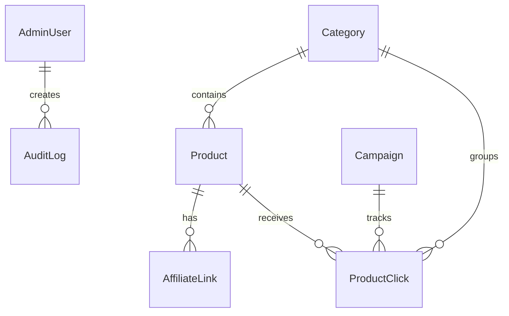

# Modelo de banco de dados — Loja do Korre

## Objetivo

Este documento descreve o modelo inicial de dados da Loja do Korre.

Banco recomendado: PostgreSQL.
ORM recomendado: Prisma.

## Entidades principais



## Prisma inicial sugerido

```prisma
model AdminUser {
  id           String   @id @default(uuid())
  name         String
  email        String   @unique
  passwordHash String
  role         String   @default("admin")
  active       Boolean  @default(true)
  createdAt    DateTime @default(now())
  updatedAt    DateTime @updatedAt

  auditLogs    AuditLog[]
}

model Category {
  id          String   @id @default(uuid())
  name        String
  slug        String   @unique
  description String?
  icon        String?
  sortOrder   Int      @default(0)
  active      Boolean  @default(true)
  createdAt   DateTime @default(now())
  updatedAt   DateTime @updatedAt

  products    Product[]
  clicks      ProductClick[]
}

model Product {
  id                    String   @id @default(uuid())
  categoryId            String
  category              Category @relation(fields: [categoryId], references: [id])

  name                  String
  slug                  String   @unique
  shortDescription      String?
  description           String?
  recommendationReason  String?
  vehicleType           String   @default("both")
  audience              String   @default("general")
  imageUrl              String?
  referencePriceCents   Int?
  currency              String   @default("BRL")
  status                String   @default("draft")
  featured              Boolean  @default(false)
  tags                  String[]
  createdAt             DateTime @default(now())
  updatedAt             DateTime @updatedAt

  affiliateLinks        AffiliateLink[]
  clicks                ProductClick[]
}

model AffiliateLink {
  id             String   @id @default(uuid())
  productId      String
  product        Product  @relation(fields: [productId], references: [id])

  provider       String   @default("mercado_livre")
  originalUrl    String
  affiliateUrl   String
  active         Boolean  @default(true)
  notes          String?
  createdAt      DateTime @default(now())
  updatedAt      DateTime @updatedAt
}

model Campaign {
  id          String   @id @default(uuid())
  name        String
  slug        String   @unique
  description String?
  utmSource   String?
  utmMedium   String?
  utmCampaign String?
  startsAt    DateTime?
  endsAt      DateTime?
  active      Boolean  @default(true)
  createdAt   DateTime @default(now())
  updatedAt   DateTime @updatedAt

  clicks      ProductClick[]
}

model ProductClick {
  id             String    @id @default(uuid())
  productId      String
  product        Product   @relation(fields: [productId], references: [id])
  categoryId     String?
  category       Category? @relation(fields: [categoryId], references: [id])
  campaignId     String?
  campaign       Campaign? @relation(fields: [campaignId], references: [id])

  source         String?
  utmSource      String?
  utmMedium      String?
  utmCampaign    String?
  referrer       String?
  userAgentShort String?
  ipHash         String?
  createdAt      DateTime  @default(now())
}

model AuditLog {
  id          String     @id @default(uuid())
  adminUserId String?
  adminUser   AdminUser? @relation(fields: [adminUserId], references: [id])
  action      String
  entity      String?
  entityId    String?
  detailsJson Json?
  createdAt   DateTime   @default(now())
}
```

## Status de produto

Valores sugeridos:

```txt
draft
active
inactive
archived
```

## VehicleType

Valores sugeridos:

```txt
car
motorcycle
both
```

## Audience

Valores sugeridos:

```txt
driver
motoboy
delivery
general
```

## Índices recomendados

- `Product.slug`
- `Category.slug`
- `Product.status`
- `Product.featured`
- `ProductClick.productId`
- `ProductClick.categoryId`
- `ProductClick.campaignId`
- `ProductClick.createdAt`

## Cuidados

- Não salvar dados pessoais de visitantes no MVP.
- Não salvar cartão, endereço de entrega ou informações de compra.
- Não salvar senha de admin em texto puro.
- Não expor links internos administrativos em endpoints públicos.
